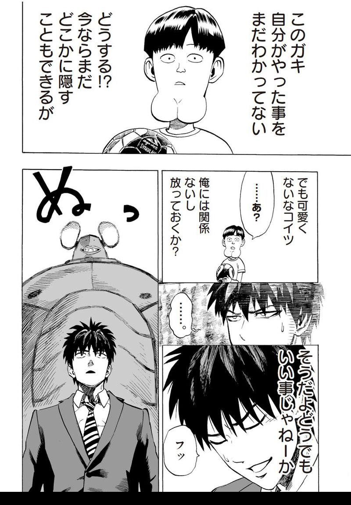
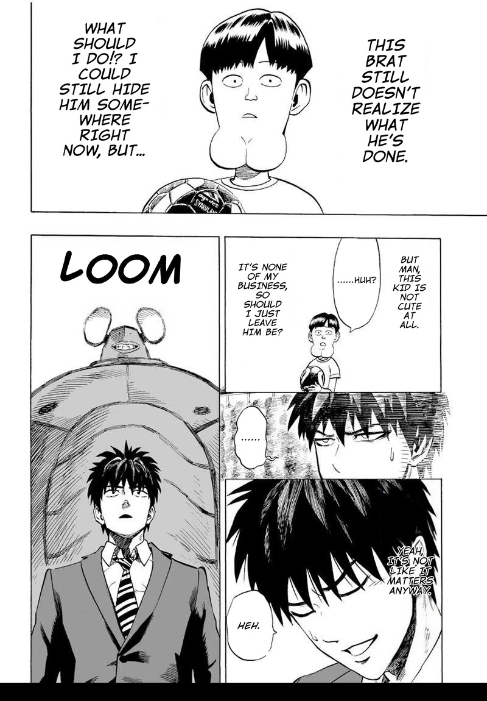

[English](../../../README.md) | [简体中文](../zh/README.md) | [한국어](README.md) | [日本語](../ja/README.md)

## MangaTranslator

AI를 사용하여 만화/코믹스 페이지 이미지 번역을 자동화하는 Gradio 기반 웹 애플리케이션입니다. 말풍선 내부 텍스트와 말풍선 외부의 텍스트를 모두 처리합니다. 60개 언어 및 사용자 정의 폰트 팩 사용을 지원합니다.

<div align="left">
  <table>
    <tr>
      <th style="text-align: left">원본</th>
      <th style="text-align: left">번역본 (클릭 한 번으로 완료)</th>
    </tr>
    <tr>
      <td></td>
      <td></td>
    </tr>
  </table>
</div>

## 목차

- [주요 기능](#주요-기능)
- [요구 사항](#요구-사항)
- [설치](#설치)
- [설치 후 설정](#설치-후-설정)
- [실행](#실행)
- [문서](#문서)
- [업데이트](#업데이트)
- [라이선스 및 크레딧](#라이선스-및-크레딧)

## 주요 기능

- **감지**: 말풍선 감지 및 세분화 (YOLO, SAM 2.1/3)
- **클리닝**: 말풍선 내부 및 말풍선 외부(OSB) 텍스트 인페인팅 (FLUX.2 Klein, FLUX.1 Kontext 또는 OpenCV)
- **번역**: LLM 기반 OCR 및 번역 (60개 언어 지원)
- **렌더링**: 정렬 및 사용자 정의 폰트 팩을 지원하는 텍스트 렌더링
- **업스케일링**: 화질 향상을 위한 2x-AnimeSharpV4 지원
- **처리**: 디렉토리 구조 보존 및 ZIP 지원을 통한 단일/배치 처리
- **인터페이스**: 웹 UI (Gradio) 및 CLI
- **자동화**: 클릭 한 번으로 번역 완료, 수동 개입 불필요

## 요구 사항

- Python 3.10+
- PyTorch (CPU, CUDA, ROCm, XPU, MPS 지원)
- `.ttf`/`.otf` 파일이 포함된 폰트 팩 (포터블 패키지에 포함됨)
- 일본어 소스 텍스트는 LLM 필요, 기타 언어는 VLM 필요 (API 또는 로컬 실행)

## 설치

### 포터블 패키지 (권장)

릴리스 페이지에서 독립 실행형 zip 파일을 다운로드하세요: [Portable Build (포터블 빌드)](https://github.com/meangrinch/MangaTranslator/releases/tag/portable)

**시스템 요구 사항:**

- **Windows:** 내장 Python/Git 포함, 별도의 요구 사항 없음
- **Linux/macOS:** 시스템에 Python 3.10+ 및 Git이 설치되어 있어야 함

**설정 방법:**

1. zip 파일 압축 해제
2. 해당 플랫폼의 설치 스크립트 실행:
   - **Windows:** `setup.bat` 더블 클릭
   - **Linux/macOS:** 터미널에서 `./setup.sh` 실행
3. 시스템 사양에 맞는 PyTorch 버전이 자동으로 감지되고 설치됨
4. `./MangaTranslator/` 내부에 생성된 실행 스크립트 열기:
   - **Windows:** `start-webui.bat`
   - **Linux/macOS:** `start-webui.sh`

포함된 폰트 팩:

- _Komika_ (일반 텍스트)
- _Comicka_ (일반/OSB 텍스트)
- _Roboto_ (악센트 기호 지원)
- _Noto Sans SC_ (간체 중국어)
- _Noto Sans KR_ (한국어)
- _Noto Sans JP_ (일본어)
- _Noto Sans Thai_ (태국어)

> [!TIP]
> 새로운 포터블 패키지로 데이터를 이전해야 하는 경우:
>
> - `fonts`, `models`, `output` 디렉토리를 새 포터블 패키지로 안전하게 이동할 수 있습니다.
> - 동일한 설정 구성을 유지하려는 경우 `runtime` 디렉토리를 그대로 이동할 수도 있습니다.

### 수동 설치

1. 저장소를 클론하고 해당 디렉토리로 이동합니다.

```bash
git clone https://github.com/meangrinch/MangaTranslator.git
cd MangaTranslator
```

2. 가상 환경을 생성하고 활성화합니다 (권장).

```bash
python -m venv venv
# Windows PowerShell/CMD
.\venv\Scripts\activate
# Linux/macOS
source venv/bin/activate
```

3. PyTorch를 설치합니다 (참고: [PyTorch 설치 가이드](https://pytorch.org/get-started/locally/))

```bash
# 예시 (CUDA 13.0)
pip install torch==2.11.0+cu130 torchvision==0.26.0+cu130 --extra-index-url https://download.pytorch.org/whl/cu130
# 예시 (ROCm 7.1)
pip install torch==2.11.0+rocm7.1 torchvision==0.26.0+rocm7.1 --extra-index-url https://download.pytorch.org/whl/rocm7.1
# 예시 (XPU)
pip install torch==2.11.0+xpu torchvision==0.26.0+xpu --extra-index-url https://download.pytorch.org/whl/xpu
# 예시 (MPS/CPU)
pip install torch==2.11.0 torchvision==0.26.0
```

4. Nunchaku 설치 (선택 사항, Nunchaku 백엔드를 통한 FLUX.1 Kontext용)

- Nunchaku의 wheel 파일은 PyPI에 등록되어 있지 않습니다. OS 및 Python 버전에 맞는 파일을 v1.3.0dev20260213 GitHub 릴리스 URL에서 직접 설치하세요. CUDA 전용이며, RTX 2000 시리즈 이상의 그래픽 카드가 필요합니다.

```bash
# 예시 (Windows, Python 3.13, PyTorch 2.11.0, CUDA 13.0)
pip install https://github.com/nunchaku-ai/nunchaku/releases/download/v1.3.0dev20260213/nunchaku-1.3.0.dev20260213+cu13.0torch2.11-cp313-cp313-win_amd64.whl

# 예시 (Linux, Python 3.13, PyTorch 2.11.0, CUDA 13.0)
pip install https://github.com/nunchaku-ai/nunchaku/releases/download/v1.3.0dev20260213/nunchaku-1.3.0.dev20260213+cu13.0torch2.11-cp313-cp313-linux_x86_64.whl
```

> [!NOTE]
> sd.cpp/SDNQ 백엔드를 통해 Flux 모델을 사용할 경우 Nunchaku는 필수 사항이 아닙니다.

5. 의존성 패키지 설치

```bash
pip install -r requirements.txt
```

## 설치 후 설정

### 모델 (Models)

- 애플리케이션 실행 시 필요한 모델들이 자동으로 다운로드 및 로드됩니다.

### 폰트 (Fonts)

- `fonts/` 디렉토리 아래에 하위 폴더를 만들고 그 안에 `.otf` 또는 `.ttf` 파일을 넣습니다.
- 파일명에 `italic`/`bold`가 포함되어 있으면 다양한 스타일 변형이 더 잘 감지됩니다.
- 예시 폴더 구조:

```text
fonts/
├─ CC Wild Words/
│  ├─ CCWildWords-Regular.otf
│  ├─ CCWildWords-Italic.otf
│  ├─ CCWildWords-Bold.otf
│  └─ CCWildWords-BoldItalic.otf
└─ Komika/
   ├─ KOMIKA-HAND.ttf
   └─ KOMIKA-HANDBOLD.ttf
```

### LLM 설정 (LLM setup)

- 지원 제공자: Google, OpenAI, Anthropic, SpaceXAI, DeepSeek, Z.ai, Moonshot AI, Xiaomi MiMo, OpenRouter, OpenAI-Compatible (OpenAI 호환)
- 웹 UI: Config (설정) 탭에서 제공자/모델/API 키를 설정합니다 (로컬에 저장됨).
- CLI: 명령줄 플래그 또는 환경 변수를 통해 키/URL을 전달합니다.
- 환경 변수: `GOOGLE_API_KEY` / `GEMINI_API_KEY`, `OPENAI_API_KEY`, `ANTHROPIC_API_KEY`, `SPACEXAI_API_KEY` / `XAI_API_KEY`, `DEEPSEEK_API_KEY`, `ZAI_API_KEY`, `MOONSHOT_API_KEY`, `MIMO_API_KEY`, `OPENROUTER_API_KEY`, `OPENAI_COMPATIBLE_API_KEY`
- OpenAI 호환 제공자의 기본 URL: `http://localhost:8080/v1`

> [!NOTE]
> OpenAI 호환 제공자를 통해 다음 모델들을 사용하면 자동으로 감지되어 최적화된 프롬프트가 적용됩니다. 이 모델들은 텍스트 전용이므로 2단계 번역 모드 및 로컬 OCR 모델을 활성화해야 합니다. `special_instructions` (특별 지침) 필드는 해당 용어집/용어에 매핑됩니다 (줄바꿈으로 구분, 예: `term -> translation`).
>
> - **YanoljaNEXT-Rosetta** (예: `yanolja/YanoljaNEXT-Rosetta-4B-2511-GGUF`)
> - **Hy-MT2** (예: `tencent/Hy-MT2-7B`). 해당 모델의 권장 샘플링 매개변수도 자동으로 입력됩니다.

### 말풍선 외부 (OSB) 텍스트 설정 (선택 사항)

말풍선 외부 텍스트 클리닝 및 복구 파이프라인을 사용하려면 다음 Hugging Face 저장소에 대한 액세스 권한이 있는 토큰이 필요합니다:

- `deepghs/AnimeText_yolo`

#### 토큰 생성 방법:

1. Hugging Face 계정에 로그인하거나 새로 만듭니다.
2. 다음 주소로 이동하여 이용약관에 동의합니다:
   - [AnimeText_yolo](https://huggingface.co/deepghs/AnimeText_yolo)
   - [FLUX.1 Kontext (dev)](https://huggingface.co/black-forest-labs/FLUX.1-Kontext-dev) (Nunchaku 백엔드를 통해 FLUX.1 Kontext를 사용하는 경우 선택 사항)
   - [SAM 3](https://huggingface.co/facebook/sam3) (SAM 3를 사용하는 경우 선택 사항)
3. Hugging Face 계정 설정에서 제한된 저장소의 읽기 권한을 가진 새 Access Token을 만듭니다 ("Read access to contents of public gated repos").
4. 생성한 토큰을 앱에 추가합니다:
   - 웹 UI: Config 탭에서 `hf_token` 설정
   - 환경 변수 (대체 방법): `HF_TOKEN` 설정
5. 세션 간 설정을 유지하기 위해 설정을 저장(Save Config)합니다.

## 실행

### 웹 UI (Gradio)

- **포터블 패키지:**
  - Windows: `MangaTranslator` 폴더 내의 `start-webui.bat` 더블 클릭
  - Linux/macOS: 터미널에서 `MangaTranslator` 폴더 내의 `./start-webui.sh` 실행
- **수동 설치:**
  - Windows/Linux/macOS: `python app.py --open-browser` 실행

옵션 플래그: `--models` (기본값 `./models`), `--fonts` (기본값 `./fonts`), `--port` (기본값 `7676`), `--cpu`.
첫 실행 시 로딩에 1~2분 정도 걸릴 수 있습니다.

웹 UI가 실행되면 Config 탭에서 LLM 제공자를 설정한 후, 이미지를 업로드하고 Translate를 클릭하세요.

### CLI

사용 예시:

```bash
# 단일 이미지, 일본어 → 영어, Google 번역 제공자 사용
python main.py --input <이미지_경로> \
  --font-dir "fonts/Komika" --provider Google --google-api-key <AI_키...>

# 배치 폴더, 소스 및 타겟 언어 지정, OpenAI 호환 제공자 (llama.cpp) 사용
python main.py --input <폴더_경로> --batch \
  --font-dir "fonts/Komika" \
  --input-language <소스_언어> --output-language <타겟_언어> \
  --provider OpenAI-Compatible --openai-compatible-url http://localhost:8080/v1 \
  --output ./output

# 단일 이미지, 일본어 → 영어 (Google), 말풍선 외부 텍스트 파이프라인 활성화 및 전용 폰트 지정
python main.py --input <이미지_경로> \
  --font-dir "fonts/Komika" --provider Google --google-api-key <AI_키...> \
  --osb-enable --osb-font-dir "fonts/Clementine"

# 클리닝 전용 모드 (번역 및 텍스트 렌더링 없이 글자 지우기만 수행)
python main.py --input <이미지_경로> --cleaning-only

# 업스케일링 전용 모드 (감지/번역 없이 이미지만 2배 확대)
python main.py --input <이미지_경로> --upscaling-only --image-upscale-mode final --image-upscale-factor 2.0

# 테스트 모드 (실제 번역 없이 임시 플레이스홀더 텍스트 렌더링)
python main.py --input <이미지_경로> --test-mode

# 전체 명령줄 옵션 확인
python main.py --help
```

## 문서

- [하드웨어 요구 사항](HARDWARE_REQUIREMENTS.md)
- [추천 폰트](FONTS.md)
- [문제 해결 가이드](TROUBLESHOOTING.md)

## 업데이트

### 포터블 패키지

- Windows: 포터블 패키지 루트 디렉토리의 `update.bat` 실행
- Linux/macOS: 포터블 패키지 루트 디렉토리의 `./update.sh` 실행

### 수동 설치

저장소 루트에서 다음 명령을 실행합니다:

```bash
git pull
pip install -r requirements.txt  # 가상 환경을 사용 중인 경우 먼저 활성화하세요.
```

## 라이선스 및 크레딧

- 라이선스: Apache-2.0 (상세 내용은 [LICENSE](../../../LICENSE) 참조)
- 제작자: [grinnch](https://github.com/meangrinch)

<details>
<summary><b>머신러닝 모델 및 라이브러리</b></summary>

- YOLOv8m 말풍선 감지기: [kitsumed](https://huggingface.co/kitsumed/yolov8m_seg-speech-bubble)
- Manga109 말풍선 감지기: [huyvux3005](https://huggingface.co/huyvux3005/manga109-segmentation-bubble)
- Comic 텍스트·말풍선 감지 RT-DETR-v2: [ogkalu](https://huggingface.co/ogkalu/comic-text-and-bubble-detector)
- Manga109 YOLO: [deepghs](https://huggingface.co/deepghs/manga109_yolo)
- AnimeText YOLO: [deepghs](https://huggingface.co/deepghs/AnimeText_yolo)
- SAM 2.1: Segment Anything in Images and Videos: [Meta AI](https://huggingface.co/facebook/sam2.1-hiera-large)
- SAM 3: [Meta AI](https://huggingface.co/facebook/sam3)
- Manga OCR: [kha-white](https://github.com/kha-white/manga-ocr)
- PaddleOCR-VL-1.6: [PaddlePaddle](https://huggingface.co/PaddlePaddle/PaddleOCR-VL-1.6)
- FLUX.1 Kontext: [Black Forest Labs](https://huggingface.co/black-forest-labs/FLUX.1-Kontext-dev)
- FLUX.2 Klein 4B: [Black Forest Labs](https://huggingface.co/black-forest-labs/FLUX.2-klein-4B)
- FLUX.2 Klein 9B: [Black Forest Labs](https://huggingface.co/black-forest-labs/FLUX.2-klein-9B)
- Nunchaku: [Nunchaku AI](https://github.com/nunchaku-ai/nunchaku)
- SDNQ Quants: [Disty0](https://huggingface.co/Disty0)
- Unsloth Quants: [Unsloth](https://huggingface.co/unsloth)
- stable-diffusion.cpp: [leejet](https://github.com/leejet/stable-diffusion.cpp)
- 2x-AnimeSharpV4: [Kim2091](https://huggingface.co/Kim2091/2x-AnimeSharpV4)

</details>
